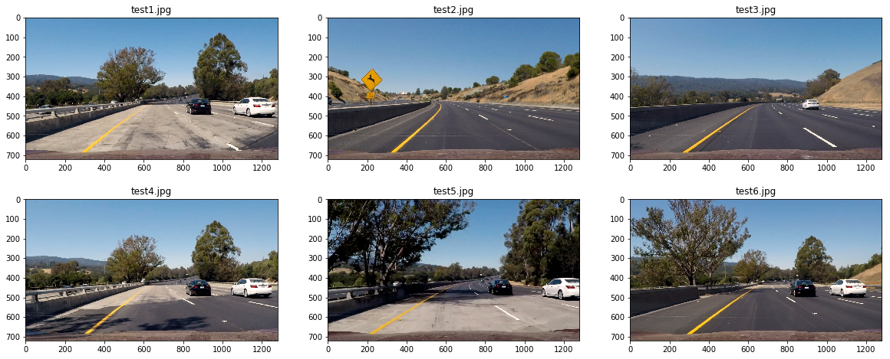
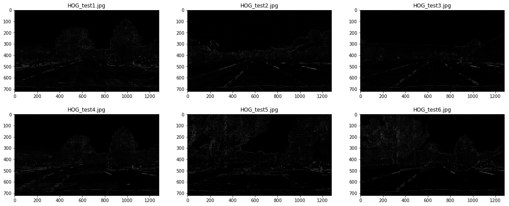
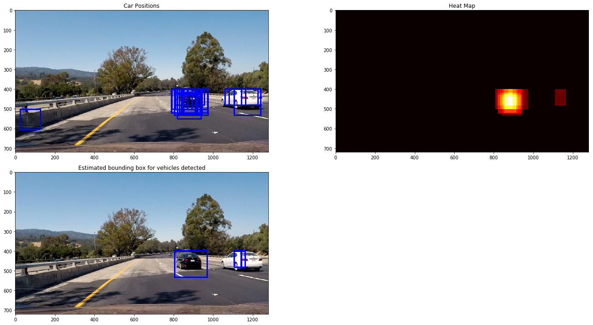
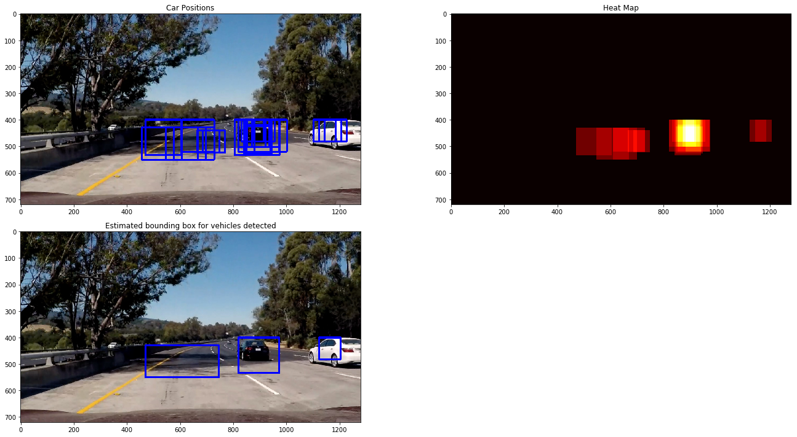
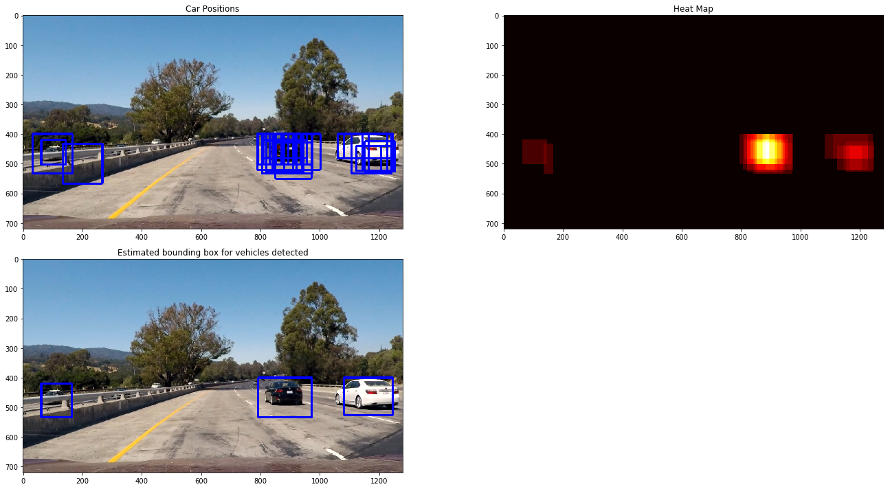

# Project: Vehicle Detection and Tracking


## Goals:

The goals / steps of this project are the following:

(1) Perform a Histogram of Oriented Gradients (HOG) feature extraction on a labeled training set of images and train a classifier Linear SVM classifier

(2) Optionally, you can also apply a color transform and append binned color features, as well as histograms of color, to your HOG feature vector.

(3) Note: for those first two steps don't forget to normalize your features and randomize a selection for training and testing.

(4) Implement a sliding-window technique and use your trained classifier to search for vehicles in images.

(5) Run your pipeline on a video stream (start with the testvideo.mp4 and later implement on full projectvideo.mp4) and create a heat map of recurring detections frame by frame to reject outliers and follow detected vehicles.
 
(6) Estimate a bounding box for vehicles detected.

## Description of the result files
- output\_images/HOG: resulting images from the HOG transformation
- output\_images/project\_video\_output.mp4: resulting video from the pipeline
- output\_images/test\_video\_output.mp4 resulting video from the test pipeline
- set\_non\_vehicles/*.jpeg: set of non vehicles for the training of the SVM-Model. (complete set available [here](https://s3.amazonaws.com/udacity-sdc/Vehicle_Tracking/non-vehicles_smallset.zip)) 
- set\_vehicles/*.jpeg: set of vehicles for the training of the SVM-Model. (complete set available [here](https://s3.amazonaws.com/udacity-sdc/Vehicle_Tracking/vehicles_smallset.zip))

- helpers.py: implemetation of car finding algorithm helpers
- **VehicleDetectionAndTracking.ipynb**: main project file

## References
- [HOG Descriptors](http://carlvondrick.com/ihog/)
- [OpenCV Object detection](http://docs.opencv.org/2.4/modules/gpu/doc/object_detection.html)
- [HOG - Multiscale parameters detection](https://www.pyimagesearch.com/2015/11/16/hog-detectmultiscale-parameters-explained/)
- [Udacity ND013 Vehicle Detection and Tracking](https://classroom.udacity.com/nanodegrees/nd013/syllabus/core-curriculum)
- [SVM](http://scikit-learn.org/stable/modules/generated/sklearn.svm.SVC.html)
- [LinearSVC](http://scikit-learn.org/stable/modules/generated/sklearn.svm.LinearSVC.html)

## Histogram of Oriented Gradients (HOG)

### 1. Explain how (and identify where in your code) you extracted HOG features from the training images.

The code for this step is located in the method `get_hog_features` of the Python file called `helpers.py`. The extration is based on the Hog-function of the module `skimage.feature`

### 2. Explain how you settled on your final choice of HOG parameters.

For test purposes, i started by reading in the `test*.jpg` from the test images folder. Here are the corresponding test images. I choose to take those images because they contain regions with and without vehicles.



Then i tried differents combinaitions of parameters with two colorspaces in mind (HSV, YCrCb). I finally found out that the following parameters were suitable for my goal in comparison to other combinations:

- orientations = 9
- pixels\_per\_cell = 8
- cells\_per\_block = 2
- cells\_per\_block = 2
- spatial\_size = 32 x 32

Here is an example* using the `YCrCb` color space and the following HOG descriptors:



*Please open the original images and zoom into them to have a besser inside of the HOG-descriptors.

### 3. Describe how (and identify where in your code) you trained a classifier using your selected HOG features (and color features if you used them).

The code for this step is located in the file `VehicleDetectionAndTracking.ipynb` section: `(2) & (3) Linear SVM Classifier` and consist of these Steps:

1. Extracts features (HOG and Color) of both non cars and cars training data and saves them in to two distincts numpy arrays
2. Stacks the two previously geneated arrays verticaly resulting into a single array.
3. Standardizes features in that array by removing the mean and scaling to unit variance
4. Performs standardization by centering and scaling the features
5. Defines the labels vector
6. Splits up data into randomized training and test sets
7. fits a Linear Support Vector Classification on the training data 
8. finally test the Linear SVC accuracy on the test data


## Sliding Window Search

### 1. Describe how (and identify where in your code) you implemented a sliding window search.  How did you decide what scales to search and how much to overlap windows?

The code for this step is located in the method `find_cars` of the Python file called `helpers.py`. I have adapted the proposed solution of the course since i was satisfied with the provided optimization. I have applied the method on well defined Regions of interest with multiple scales.
Here are the choosen settings for those regions:

```python
# Define namedtuple for region definition
roi_1 = namedtuple('ROI', 'ymin' 'ymax' 'scale')
roi_1.ymin = 400
roi_1.ymax = 656
roi_1.scale = 1.3

roi_2 = namedtuple('ROI', 'ymin' 'ymax' 'scale')
roi_2.ymin = 400
roi_2.ymax = 656
roi_2.scale = 1.6

roi_3 = namedtuple('ROI', 'ymin' 'ymax' 'scale')
roi_3.ymin = 400
roi_3.ymax = 656
roi_3.scale = 1.9

roi_4 = namedtuple('ROI', 'ymin' 'ymax' 'scale')
roi_4.ymin = 400
roi_4.ymax = 656
roi_4.scale = 2.1

ROI = [roi_1, roi_2, roi_3, roi_4]
```

### 2. Show some examples of test images to demonstrate how your pipeline is working.  What did you do to optimize the performance of your classifier?

Ultimately I searched on two scales using YCrCb 3-channel HOG features plus spatially binned color and histograms of color in the feature vector, which provided a nice result. Here are some example images:








### Video Implementation

### 1. Provide a link to your final video output.  Your pipeline should perform reasonably well on the entire project video (somewhat wobbly or unstable bounding boxes are ok as long as you are identifying the vehicles most of the time with minimal false positives.)

Here's a [link to my video result](./output_images/project_video_output.mp4)


### 2. Describe how (and identify where in your code) you implemented some kind of filter for false positives and some method for combining overlapping bounding boxes.

I recorded the positions of positive detections in each frame of the video.  From the positive detections I created a heatmap that I saved in a heatmap container. Every 15 frames I calculated the mean of 15 last saved heatmaps and then thresholded that map to identify vehicle positions.  I then used `scipy.ndimage.measurements.label()` to identify individual blobs in the heatmap.  I then assumed each blob corresponded to a vehicle.  I constructed bounding boxes to cover the area of each blob detected. 

---

## Discussion

### 1. Briefly discuss any problems / issues you faced in your implementation of this project.  Where will your pipeline likely fail?  What could you do to make it more robust?

Overall this approach of tracking vehicles is good and the robustness depends on the choosen neural network for the detection. The main problem I encountered was getting rid of the false positives. After some experimentations I realized that the SVM could not generalized very well. A possible solution could be to use convolutional neural network to detect the car within the sliding window algorithm. It could improve the detection and therefore make the pipeline more robust.


